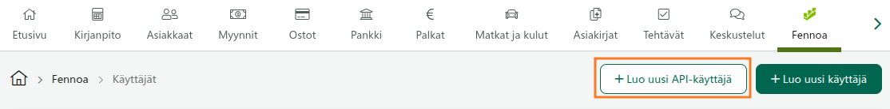
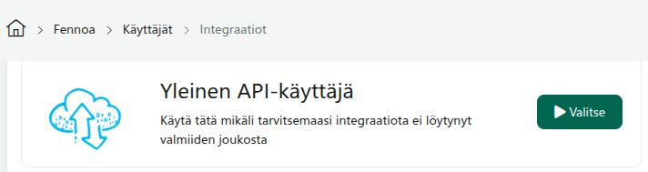
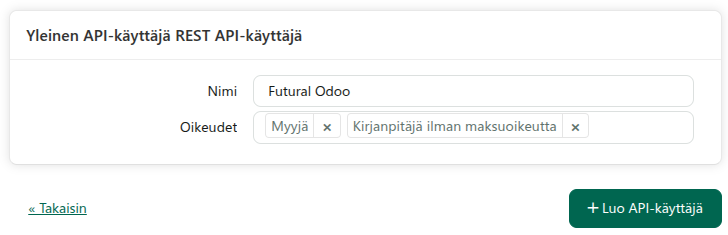
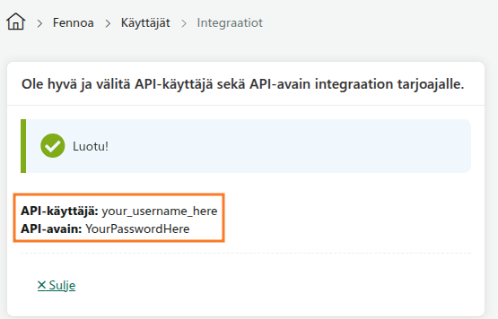
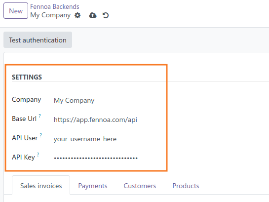
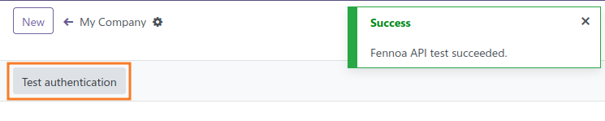

You need to:
1. Create **Fennoa API user** in Fennoa
2. Create **Fennoa Backend** in Odoo

## Fennoa
1. Go to *Fennoa https://app.fennoa.com/* with your admin user
2. Go to *Fennoa \> Users (Käyttäjät)*
3. Create a new *API user* (*API-käyttäjä*)

4. Select **General API user** (*Yleinen API-käyttäjä*), or **Odoo (Futural)**

5. Give an user name (e.g. *Futural Odoo*), and necessary permissions. Click *Create API user* (*Luo API-käyttäjä*)

6. Copy your *API-user* (*API-käyttäjä*) and *API-key* (*API-avain*) to a safe place

## Odoo
1. Make sure the OCA [Job Queue](https://github.com/OCA/queue ) framework is available and configured correctly.
2. Go to *Connectors \> Fennoa*.
3. Create a backend for your company (or companies). Use the *API-user* and *API-key* from Fennoa API User 

4. Press **Test Connection** to validate credentials. You should see a success-message

5. (Optional) Click **Import Customers** to fetch customer master data from Fennoa.
6. (Optional) Configure/disable Schedulers by clicking **Scheduled Actions**-button

Now you should be good to go!
Create an invoice and try sending it.
If you get an error, read the error description and act accordingly.